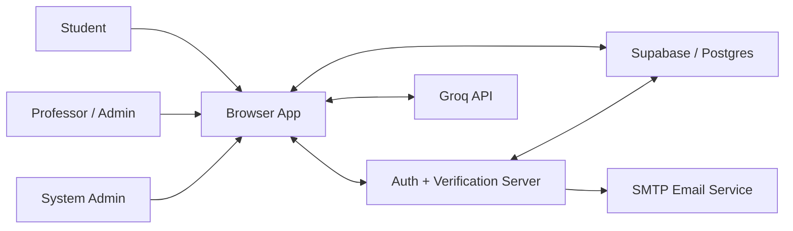
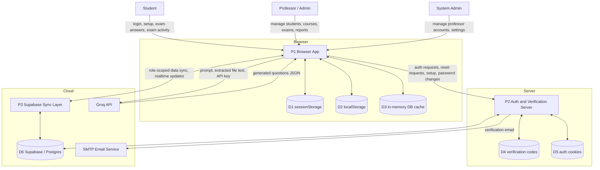
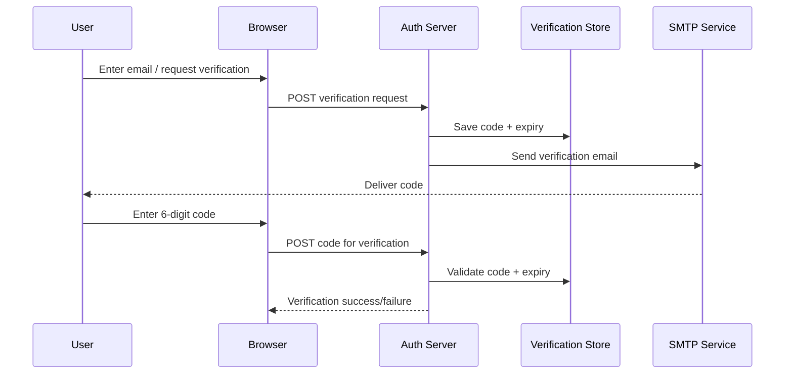

# Data Flow Diagram

This document describes how data is handled inside the ExamGuard/TUKLAS system, based on the current code flow.

## Scope

This DFD focuses on:

- how users send data into the system
- where the system temporarily holds data
- where the system permanently stores data
- how data moves between the browser, the Node auth server, Supabase, email delivery, and the AI question generator

It does not focus on UI layout or page navigation unless that affects data movement.

## External Entities

- `Student`
- `Professor/Admin`
- `System Admin`
- `SMTP Email Service`
- `Groq API`

## Core Processes

- `P1. Browser App`
- `P2. Auth and Verification Server`
- `P3. Supabase Sync Layer`
- `P4. Exam Monitoring and Submission`
- `P5. AI Question Generation`

## Data Stores

- `D1. Browser sessionStorage`
- `D2. Browser localStorage`
- `D3. In-memory DB cache (window.DB)`
- `D4. Auth server verification store (in-memory Map)`
- `D5. HTTP-only auth cookies`
- `D6. Supabase/Postgres tables`

## Level 0 DFD

## Level 1 DFD

## Main Data Flows

### 1. App bootstrap and data hydration

1. The browser loads the page.
2. The React/Supabase bootstrap exposes the Supabase client to `window`.
3. `SupabaseSync` pulls role-scoped data from Supabase into `window.DB`.
4. `window.DB` becomes the working in-memory store for students, subjects, exams, sessions, logs, settings, and admin records.
5. Realtime listeners push later changes back into the browser cache.

### 2. Authentication and account recovery flow

1. A user submits login, verification, reset, or setup data from the browser.
2. The browser sends that data to the Node auth server at `/api/auth/...`.
3. The auth server reads and validates the request body.
4. The server checks records directly in Postgres using the server-side `pg` connection.
5. Passwords are verified on the server and stored as hashed values.
6. If login succeeds, the server writes an HTTP-only signed session cookie.
7. The browser also stores a non-sensitive session snapshot in `sessionStorage` for client-side page state.
8. For verification or password reset, the server creates a 6-digit code and stores it in the in-memory verification store with an expiry.
9. The server sends that code through SMTP email.
10. When the user submits the code, the server validates it from memory, then allows reset or setup completion.

### 3. Student exam flow

1. The student session is loaded from `sessionStorage` and validated against the server when needed.
2. Exam, subject, and prior session data are pulled from Supabase into the browser cache.
3. When the student starts or resumes an exam, a session record is created or updated in `window.DB`.
4. As the student answers questions, the browser updates:
   - `answers`
   - `warnings`
   - `activities`
   - `cameraSnapshots`
5. Those session updates are sent to Supabase through `SupabaseSync.syncDoc('sessions', ...)`.
6. Anti-cheat events also create log entries that are synced into the `logs` table.
7. If the student submits, times out, refreshes, or hits violation limits, the session is marked submitted and the final score is written into the session record.
8. If the browser goes offline, the session state stays in the browser cache and resyncs when connectivity returns.

### 4. Professor/admin data flow

1. The professor logs in through the auth server.
2. After authentication, the browser pulls only professor-scoped records from Supabase.
3. When the professor creates or edits students, subjects, exams, settings, or manual grading results:
   - data is first updated in `window.DB`
   - then synced to Supabase
4. Professor actions may also generate:
   - `sessions` updates
   - `logs` updates
   - `professor_activity_log` updates
5. Realtime Supabase listeners push those changes to other active clients.

### 5. System admin flow

1. The system admin authenticates through the Node auth server.
2. Professor account creation, update, deletion, password changes, and system settings go through the server, not directly through the public Supabase client.
3. The server writes those changes into Postgres.
4. The browser then refreshes data from Supabase so the UI reflects the new state.

### 6. Email verification flow

### 7. AI question generation flow

1. The professor uploads files such as `PDF`, `DOCX`, `PPTX`, or `TXT`.
2. File text extraction happens in the browser.
3. The browser reads the saved API key from settings already loaded into the local app state.
4. The browser sends extracted material and prompt instructions directly to the Groq API.
5. Groq returns generated question JSON.
6. The browser converts the returned JSON into exam questions.
7. When the professor imports those questions, the updated exam is saved into `window.DB` and synced to Supabase.

## Data Store Summary

| Store                         | Purpose                            | Typical Data                                                                                        |
| ----------------------------- | ---------------------------------- | --------------------------------------------------------------------------------------------------- |
| `sessionStorage`            | short-lived client session state   | admin/student/sysadmin session snapshots, password-reset progress, refresh auto-submit marker       |
| `localStorage`              | client preferences only            | theme, exam font scale                                                                              |
| `window.DB` in-memory cache | primary browser-side working store | settings, professors, students, subjects, exams, sessions, logs                                     |
| verification`Map` on server | temporary verification state       | email, code, expiry, verified flag                                                                  |
| HTTP-only cookies             | trusted auth session state         | signed professor, student, or sysadmin session payload                                              |
| Supabase/Postgres             | persistent system record           | professors, students, subjects, exams, sessions, logs, settings, superadmin, professor activity log |

## Sensitive Data Handling

- Passwords are handled only by the Node auth server and stored as PBKDF2 hashes in the database.
- The browser does not pull password fields through the Supabase sync layer.
- Auth cookies are signed and marked `HttpOnly`.
- Verification codes are temporary and stored only in server memory.
- Student exam surveillance data such as `activities` and `cameraSnapshots` is stored in session records and synced to Supabase.
- The AI key is stored in system settings and then used by the browser for direct Groq requests.

## System Data Boundary Notes

- Authentication is split from the main app data sync.
  The browser uses the Node server for identity, password, and verification flows.
- Operational data is mostly client-driven.
  Students, subjects, exams, sessions, logs, and settings are mainly read and written through the browser plus Supabase sync.
- The browser is stateful.
  The current working copy of most app data lives in the in-memory cache first, then syncs outward.
- Realtime updates are eventual rather than strictly transactional across all clients.
  Supabase listeners update active browsers after records are written.

## Short DFD Interpretation

At a high level, the system has two parallel data paths:

1. `Auth path`
   Browser -> Node auth server -> Postgres/email -> cookies/session state
2. `Application data path`
   Browser -> in-memory cache -> Supabase sync -> Supabase/Postgres -> realtime updates back to browsers

The exam flow is centered in the browser, while identity and password handling are centered on the server.
